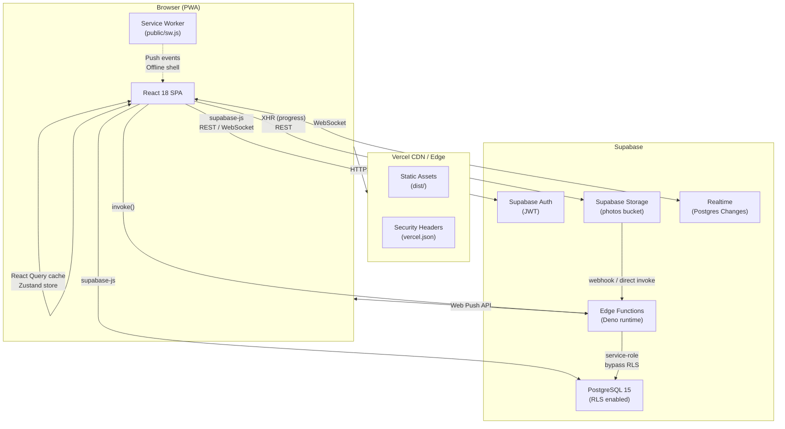
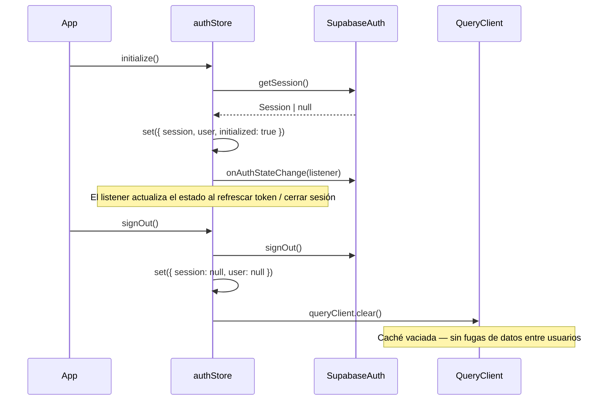
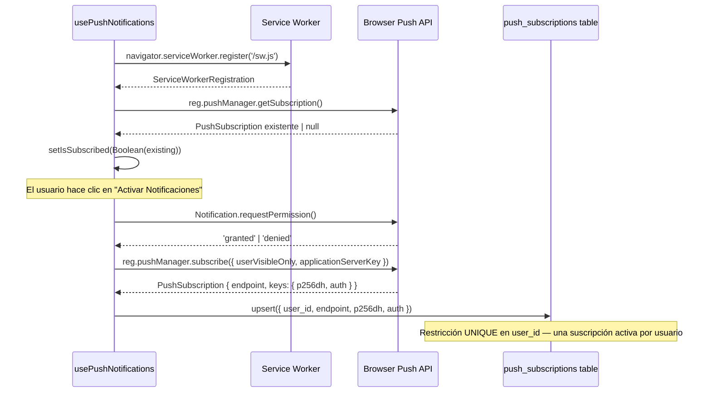
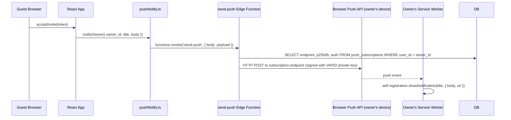
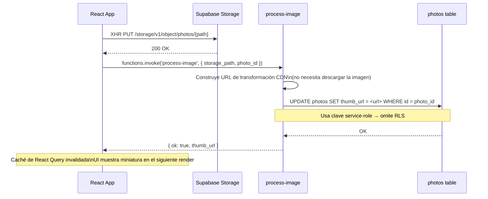
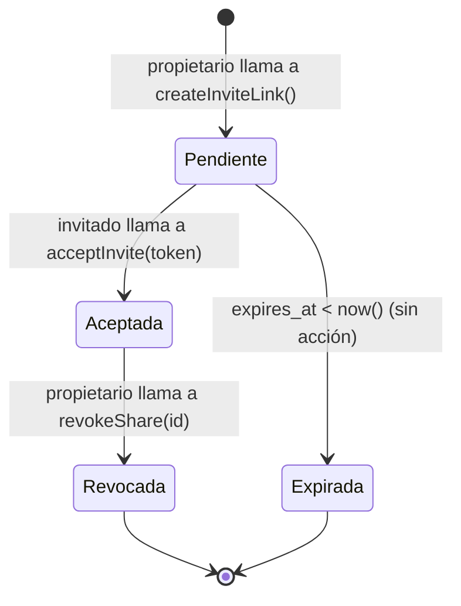
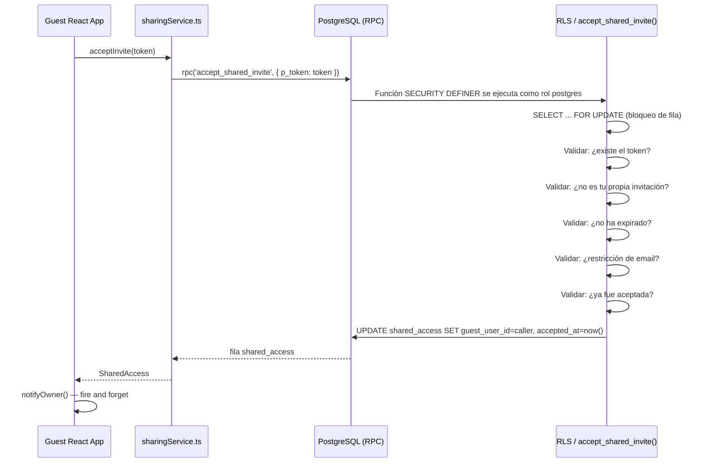
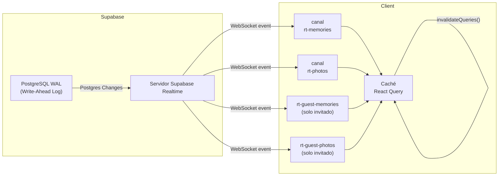
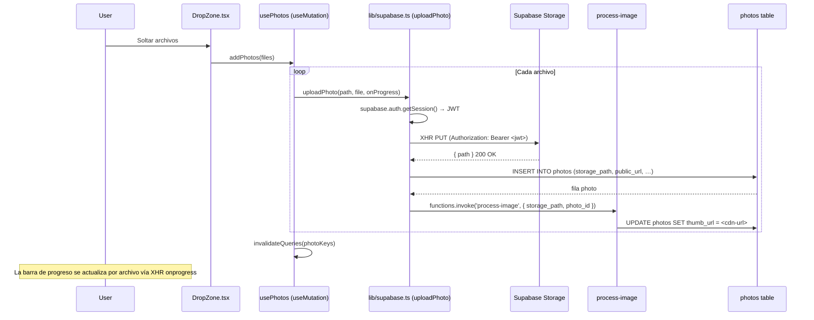

# Arquitectura y Flujo de Datos

---

## Tabla de Contenidos

1. [Arquitectura General](#1-arquitectura-general)
2. [Autenticación y Gestión de Sesión](#2-autenticación-y-gestión-de-sesión)
3. [Ciclo de Vida de Notificaciones Push](#3-ciclo-de-vida-de-notificaciones-push)
4. [Edge Function: `process-image`](#4-edge-function-process-image)
5. [Sistema de Invitaciones y Compartición](#5-sistema-de-invitaciones-y-compartición)
6. [Sincronización en Tiempo Real](#6-sincronización-en-tiempo-real)
7. [Pipeline de Subida de Fotos](#7-pipeline-de-subida-de-fotos)
8. [Estrategia de Caché en el Cliente](#8-estrategia-de-caché-en-el-cliente)

---

## 1. Arquitectura General



---

## 2. Autenticación y Gestión de Sesión

La autenticación es gestionada exclusivamente por **Supabase Auth**. El lado cliente utiliza un store de Zustand (`authStore.ts`) como única fuente de verdad para la sesión activa.



**Decisiones de diseño clave:**

- `initialize()` es idempotente (protegido contra la doble invocación de React StrictMode).
- `signOut()` llama a `queryClient.clear()` mediante el **singleton** `queryClient` importado desde `lib/queryClient.ts`, garantizando que ningún dato en caché sea visible para un usuario posterior en el mismo dispositivo.
- Ante un error de red durante el cierre de sesión, el estado local se resetea igualmente (bloque `finally`) para que la UI nunca quede bloqueada en estado autenticado.

---

## 3. Ciclo de Vida de Notificaciones Push

El sistema push tiene dos canales de notificación diferenciados:

| Canal | Disparador | Transporte |
|---|---|---|
| **Recordatorios de aniversario** | Carga de página — el cliente compara las fechas de recuerdos con el mes/día de hoy | API `Notification` local (no requiere servidor) |
| **Invitación aceptada** | El invitado llama a `acceptInvite()` → `notifyOwner()` → Edge Function | Web Push mediante la Edge Function `send-push` |

### 3.1 Registro del Service Worker y Suscripción



### 3.2 Envío de una Notificación Push (Flujo de Aceptación de Invitación)



**Manejo de errores:** `notifyOwner()` es **fire-and-forget**. Refresca el token de sesión antes de la invocación para evitar errores 401 silenciosos por JWTs caducados. Todos los errores son capturados y registrados solo en desarrollo — un fallo push nunca es visible para el usuario.

### 3.3 Detección de Aniversarios (Lado Cliente)

En cada carga de página, `checkAnniversaries()` obtiene todos los recuerdos de la tabla `memories` de Supabase y compara el par `(mes, día)` de cada `memory_date` con el `(mes, día)` de hoy. Si se encuentra una coincidencia en un año anterior, se muestra una notificación local. No se necesita ninguna llamada al servidor para esta verificación.

---

## 4. Edge Function: `process-image`

**Ubicación:** `supabase/functions/process-image/index.ts`  
**Runtime:** Supabase Edge Runtime (Deno)  
**Auth:** `--no-verify-jwt` — el invocador debe pasar una sesión Supabase válida o la clave service-role

### Propósito

Desppués de que una foto se sube al bucket `photos` de Storage, esta función genera una URL de miniatura y la escribe de vuelta en la fila de la tabla `photos` (columna `thumb_url`). La UI puede entonces cargar la miniatura pequeña para las vistas de cuadrícula en lugar de la imagen a tamaño completo.

### Detalle de Implementación

La función **no** utiliza una librería de procesamiento de imágenes en el servidor (como `sharp`). En su lugar, construye una **URL de Transformación de Imágenes de Supabase Storage** — una URL de CDN que redimensiona en el primer acceso y almacena en caché en el edge:

```
https://<project>.supabase.co/storage/v1/render/image/public/photos/<path>
  ?width=200&height=200&resize=cover
```

Este enfoque intercambia tiempo de CPU en la Edge Function por un hit de caché CDN en las solicitudes siguientes.



---

## 5. Sistema de Invitaciones y Compartición

### Conceptos

| Término | Significado |
|---|---|
| **Propietario (Owner)** | El usuario cuyos recuerdos se están compartiendo. |
| **Invitado (Guest)** | Un usuario registrado que aceptó una invitación. |
| **Token de Invitación** | UUID criptográficamente aleatorio. De un solo uso. Caduca en 7 días. |
| **Permiso** | `read` (solo lectura) o `write` (puede crear/editar/eliminar). |
| **shared_access** | La tabla de unión que rastrea la relación entre propietario e invitado. |

### Ciclo de Vida de la Invitación



### Flujo Detallado de Aceptación (SECURITY DEFINER)

La aceptación de invitaciones fue reforzada en la migración `20260302000001_secure_invite_acceptance.sql` para prevenir un ataque de enumeración donde cualquier usuario autenticado pudiese listar invitaciones pendientes.



**¿Por qué `SECURITY DEFINER`?**  
Las políticas `UPDATE` estándar de RLS requieren que el usuario invocador pueda previamente hacer `SELECT` a la fila que va a actualizar. Esto crea un problema de huevo y gallina: el invitado necesita leer la fila para aceptarla, pero no podemos exponer todas las invitaciones pendientes a todos los usuarios autenticados. La función `SECURITY DEFINER` se ejecuta con privilegios elevados, realiza todas las validaciones atómicamente con un bloqueo `FOR UPDATE` (previniendo condiciones de carrera en aceptaciones concurrentes), y devuelve el resultado al invocador — sin exponer jamás los datos en bruto de la tabla.

### Modo Invitado en la App React

El hook `useGuestMode` lee la fila activa de `shared_access` y proporciona `ownerId` (el `user_id` del propietario) al resto de la aplicación. Los componentes y servicios comprueban `ownerId` para limitar el alcance de las consultas y mutaciones:

- Las **Consultas** usan `ownerId` como filtro `user_id` para que los invitados vean los datos del propietario.
- Las **Mutaciones** comprueban el permiso (`read` vs `write`) antes de permitir operaciones que modifican datos.
- El **Tiempo Real** (`useRealtimeSync`) abre canales dedicados filtrados por `ownerId` para que los invitados reciban cambios en vivo del propietario.

---

## 6. Sincronización en Tiempo Real

`useRealtimeSync` (montado una vez en `AppLayout`) abre canales de Supabase Realtime en las tablas `memories` y `photos`.



En cualquier evento de cambio (`INSERT`, `UPDATE`, `DELETE`):

1. Las query keys relevantes son **invalidadas** mediante `queryClient.invalidateQueries()`.
2. React Query vuelve a obtener los datos en segundo plano.
3. La UI se actualiza sin necesidad de recargar la página manualmente.

**Canal de invitado:** Sin canales dedicados para el invitado, un usuario invitado solo recibiría eventos para filas con `user_id = guest_id`. Dado que los recuerdos del propietario tienen `user_id = owner_id`, el invitado nunca vería actualizaciones en vivo. Los canales adicionales filtrados por `ownerId` resuelven esto.

---

## 7. Pipeline de Subida de Fotos



**¿Por qué XHR en lugar de `fetch`?** El método `storage.upload()` de Supabase JS v2 no expone el progreso de la subida. Se usa una petición XHR nativa específicamente para transmitir eventos `onprogress` al estado `UploadProgress`, habilitando la barra de progreso por archivo en la UI.

---

## 8. Estrategia de Caché en el Cliente

React Query es la capa de caché principal. Todas las claves de caché se definen como funciones factory en sus archivos de hook respectivos.

| Tipo de dato | `staleTime` | Disparador de invalidación |
|---|---|---|
| Lista de recuerdos | 5 min | Evento Realtime, éxito de mutación |
| Recuerdo individual | 5 min | Evento Realtime (clave de detalle), éxito de mutación |
| Fotos (por recuerdo) | 5 min | Evento Realtime, éxito de subida |
| Galería de fotos | 5 min | Evento Realtime |
| Línea de tiempo | 2 min | Evento Realtime |
| Estadísticas | Por defecto (0) | Evento Realtime |
| Lista de compartición | 5 min | Mutación de crear/revocar |
| Categorías | 5 min | Mutación de crear/actualizar/eliminar |

El **patrón singleton** para `QueryClient` (`lib/queryClient.ts`) es crítico: permite que `authStore.ts` llame a `queryClient.clear()` al cerrar sesión desde fuera del árbol React, garantizando que la caché siempre se limpie entre sesiones.
