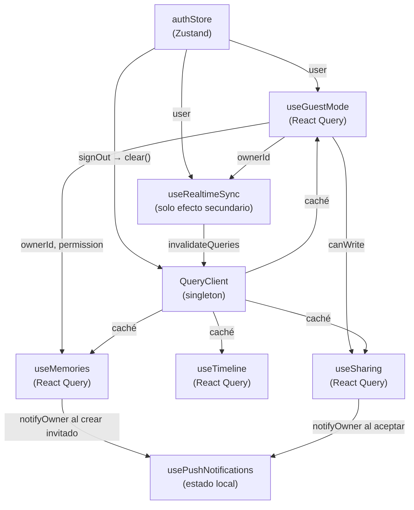

# Referencia de Hooks y Gestión de Estado

---

## Tabla de Contenidos

1. [Arquitectura de React Query](#1-arquitectura-de-react-query)
2. [Singleton QueryClient](#2-singleton-queryclient)
3. [Auth Store (Zustand)](#3-auth-store-zustand)
4. [Hook: `useGuestMode`](#4-hook-useguestmode)
5. [Hook: `useMemories`](#5-hook-usememories)
6. [Hook: `useTimeline`](#6-hook-usetimeline)
7. [Hook: `useSharing`](#7-hook-usesharing)
8. [Hook: `useRealtimeSync`](#8-hook-userealtimesync)
9. [Hook: `usePushNotifications`](#9-hook-usepushnotifications)
10. [Convenciones de Query Keys](#10-convenciones-de-query-keys)
11. [Mapa de Dependencias de Estado](#11-mapa-de-dependencias-de-estado)

---

## 1. Arquitectura de React Query

Todo el estado del servidor está gestionado por **TanStack React Query v5**. El patrón es consistente en todo el código:

```
Capa de servicios (services/*.ts)
  ↓  Funciones async puras — sin imports de React
Capa de hooks (hooks/*.ts)
  ↓  Envuelve funciones de servicio en useQuery / useMutation
Capa de componentes (components/*, pages/*)
  ↓  Consume hooks — sin llamadas directas a Supabase
```

Esta separación significa:

- Los **servicios** pueden testearse unitariamente sin montar un componente React.
- Los **hooks** centralizan todas las definiciones de claves de caché y la lógica de invalidación.
- Los **componentes** se mantienen ligeros — solo leen estado y despachan mutaciones.

---

## 2. Singleton QueryClient

**Archivo:** `src/lib/queryClient.ts`

```typescript
import { QueryClient } from '@tanstack/react-query'

/**
 * QueryClient singleton — exportado para que pueda referenciarse fuera de React
 * (p.ej. authStore.ts para limpiar la caché al cerrar sesión).
 */
export const queryClient = new QueryClient({
  defaultOptions: {
    queries: {
      staleTime: 1000 * 60 * 5,   // 5 min por defecto global
      retry: 1,
    },
  },
})
```

**¿Por qué un singleton y no `new QueryClient()` dentro del árbol de componentes?**

React Query necesita una única instancia de `QueryClient` para mantener una caché compartida. Al exportarlo como singleton a nivel de módulo:

1. `authStore.ts` puede llamar `queryClient.clear()` al cerrar sesión **desde fuera del árbol React** — sin prop drilling ni acceso al contexto.
2. `lib/pushNotify.ts` podría invalidar claves específicas de forma fire-and-forget si fuera necesario.
3. Los tests pueden importar y resetear la misma instancia.

**Uso en `main.tsx`:**

```tsx
import { QueryClientProvider } from '@tanstack/react-query'
import { queryClient } from '@/lib/queryClient'

root.render(
  <QueryClientProvider client={queryClient}>
    <App />
  </QueryClientProvider>
)
```

---

## 3. Auth Store (Zustand)

**Archivo:** `src/store/authStore.ts`

Gestiona la sesión de Supabase y expone acciones tipadas.

```typescript
const { session, user, loading, initialized } = useAuthStore()
const { initialize, signIn, signUp, signOut }  = useAuthStore()
```

| Campo | Tipo | Descripción |
|---|---|---|
| `session` | `Session \| null` | Sesión activa de Supabase (contiene el JWT) |
| `user` | `User \| null` | Objeto del usuario autenticado |
| `loading` | `boolean` | `true` durante las llamadas a `signIn` / `signUp` |
| `initialized` | `boolean` | `true` tras completar `initialize()` — previene el parpadeo del estado no autenticado |

**Llamando a `initialize()` en `App.tsx`:**

```tsx
useEffect(() => {
  useAuthStore.getState().initialize()
}, [])
```

`initialize()` es idempotente — un guard de `initialized` previene la doble ejecución bajo el doble-efecto de StrictMode de React 18.

**Limpieza de caché al cerrar sesión:**

```typescript
signOut: async () => {
  // …Supabase signOut…
  set({ session: null, user: null })
  queryClient.clear()   // ← evita fugas de datos entre usuarios
}
```

---

## 4. Hook: `useGuestMode`

**Archivo:** `src/hooks/useGuestMode.ts`

Detecta si el usuario actual está operando como invitado (es decir, aceptó la invitación de otra persona).

```typescript
const {
  isGuest,    // boolean
  ownerId,    // string | null  — el user_id del propietario
  ownerName,  // string | null
  permission, // 'read' | 'write' | null
  canWrite,   // boolean abreviado: isGuest && permission === 'write'
  isLoading,
} = useGuestMode()
```

**Cómo funciona:**

Consulta `shared_access` buscando una fila donde `guest_user_id = auth.uid()` y `accepted_at IS NOT NULL` y `expires_at > now()`. Si la encuentra, el usuario está en modo invitado y `ownerId` es el `user_id` del propietario.

**Efectos derivados de `ownerId`:**

- `useMemories`, `usePhotos` y `useTimeline` pasan `ownerId` como filtro `user_id` para que las consultas devuelvan los datos del propietario.
- `useRealtimeSync` abre canales adicionales filtrados por `ownerId`.
- `useCreateMemory(ownerId)` pasa `asUserId` para que los nuevos recuerdos se creen con el `user_id` del propietario.

---

## 5. Hook: `useMemories`

**Archivo:** `src/hooks/useMemories.ts`

### Hooks de consulta

```typescript
// Filtered list
const { data, isLoading, error } = useMemories({
  search:     'Barcelona',
  categoryId: 'uuid…',
  mood:       'happy',
  isFavorite: true,
  sortOrder:  'date_desc',
  dateFrom:   '2025-01-01',
  dateTo:     '2025-12-31',
})

// Recuerdo individual con fotos
const { data: memory } = useMemory(memoryId)
```

### Hooks de mutación

```typescript
// Crear (pasar ownerId en modo invitado-escritura)
const createMemory = useCreateMemory(ownerId ?? undefined)
createMemory.mutate({ title, content, memory_date, category_id, mood, tags })

// Actualizar
const updateMemory = useUpdateMemory()
updateMemory.mutate({ id: memoryId, input: { title, is_favorite } })

// Eliminar
const deleteMemory = useDeleteMemory()
deleteMemory.mutate(memoryId)

// Marcar/desmarcar favorito
const toggleFav = useToggleFavorite()
toggleFav.mutate({ id: memoryId, isFavorite: true })
```

### Notificación push al crear como invitado

Cuando un invitado con permiso de escritura crea un recuerdo (`asUserId !== user.id`), `useCreateMemory` llama automáticamente a `notifyOwner()` para informar al propietario:

```typescript
onSuccess: async () => {
  if (asUserId) {
    notifyOwner({
      owner_id: asUserId,
      title:    '¡Nuevo recuerdo creado! 💕',
      body:     'Tu pareja ha añadido un nuevo recuerdo.',
      url:      '/memories',
    })
  }
  qc.invalidateQueries({ queryKey: memoryKeys.all() })
}
```

### Fábrica de claves de caché

```typescript
export const memoryKeys = {
  all:    () => ['memories']                              as const,
  list:   (opts: GetMemoriesOptions) => ['memories', 'list', opts] as const,
  detail: (id: string)               => ['memories', id]  as const,
}
```

---

## 6. Hook: `useTimeline`

**Archivo:** `src/hooks/useTimeline.ts`

Obtiene todos los recuerdos agrupados por año/mes, con filtro de año y orden de clasificación opcionales. Se construye sobre `timelineService.getTimeline()` que devuelve `TimelineGroupWithMeta[]`.

```typescript
const {
  data,        // resultado bruto de la consulta (TimelineGroupWithMeta[] | undefined)
  groups,      // TimelineGroupWithMeta[] filtrados + ordenados
  totalInView, // total de recuerdos en la vista actual
  isLoading,
  error,
} = useTimeline(
  2025,   // yearFilter — undefined = mostrar todos los años
  'desc', // sortOrder  — 'desc' (más reciente primero) | 'asc' (más antiguo primero)
)

// Lista de años en el timeline completo (para la UI del filtro de año)
const years = useTimelineYears()  // number[] ej. [2026, 2025, 2024]
```

**`staleTime`:** 2 minutos (ligeramente menor que los 5 min por defecto ya que la página de Timeline es la vista principal en tiempo real).

**Memorización:** Tanto `groups` como `totalInView` se derivan con `useMemo` para que solo se recalculen cuando cambien `query.data`, `yearFilter` o `sortOrder` — no en cada renderizado.

---

## 7. Hook: `useSharing`

**Archivo:** `src/hooks/useSharing.ts`

Cuatro hooks enfocados para el flujo de trabajo de compartición.

### `useMyShares()`

Obtiene la lista de registros de invitación activos creados por el usuario actual (perspectiva del propietario).

```typescript
const { data: shares, isLoading } = useMyShares()
// shares: SharedAccess[]
```

### `useCreateInvite()`

```typescript
const createInvite = useCreateInvite()

createInvite.mutate({
  permission:  'write',        // 'read' | 'write'
  guestName:   'Mi pareja',    // nombre de visualización opcional
  guestEmail:  'partner@example.com', // restricción de email opcional
})
// Al tener éxito: la URL de invitación se copia al portapapeles y se muestra un toast
// Caché: se invalida sharingKeys.list()
```

### `useAcceptInvite(callbacks?)`

Llamado por la página `Invite` cuando un invitado abre una URL de invitación.

```typescript
const acceptInvite = useAcceptInvite({
  onAccepted: () => navigate('/'),
  onFailed:   (msg) => console.error(msg),
})

acceptInvite.mutate(tokenFromUrl)
// Internamente llama a rpc('accept_shared_invite', { p_token: token })
// Al tener éxito: envía notificación push al propietario mediante notifyOwner()
```

**Seguridad en React StrictMode:** Los callbacks se almacenan en un `useRef` para que `onSuccess` vea la versión más reciente incluso bajo el doble-efecto de StrictMode, sin añadir los callbacks al array de dependencias.

### `useRevokeShare()`

```typescript
const revokeShare = useRevokeShare()
revokeShare.mutate(shareId)
// Al tener éxito: elimina la fila shared_access e invalida sharingKeys.list()
```

---

## 8. Hook: `useRealtimeSync`

**Archivo:** `src/hooks/useRealtimeSync.ts`

**Punto de montaje:** `AppLayout.tsx` (una vez, durante toda la sesión autenticada).

Abre canales WebSocket de Supabase Realtime e invalida cachés de React Query ante cualquier evento de cambio en la base de datos.

```typescript
// Montado en AppLayout — no necesita valor de retorno
useRealtimeSync()
```

**Canales abiertos:**

| Nombre del canal | Tabla | Filtro | Invalida |
|---|---|---|---|
| `rt-memories` | `memories` | `user_id=eq.{user.id}` | `memoryKeys.all()`, `['stats']`, `['timeline']`, `memoryKeys.detail(id)` |
| `rt-photos` | `photos` | `user_id=eq.{user.id}` | `photoKeys.all()`, `photoKeys.gallery()`, `photoKeys.byMemory(memory_id)`, `memoryKeys.detail(memory_id)` |
| `rt-guest-memories` *(solo invitado)* | `memories` | `user_id=eq.{ownerId}` | Igual que `rt-memories` |
| `rt-guest-photos` *(solo invitado)* | `photos` | `user_id=eq.{ownerId}` | Igual que `rt-photos` |

**Limpieza:** La función de retorno del `useEffect` llama a `supabase.removeChannel()` para todos los canales abiertos al desmontarse (cierre de sesión o cierre de pestaña).

---

## 9. Hook: `usePushNotifications`

**Archivo:** `src/hooks/usePushNotifications.ts`

Gestiona el ciclo de vida completo de Web Push.

```typescript
const {
  permission,         // 'default' | 'granted' | 'denied' | 'unsupported'
  isSubscribed,       // boolean — true si existe una PushSubscription activa
  isRegistering,      // boolean — true durante la llamada a subscribe()
  subscribe,          // () => Promise<void>
  unsubscribe,        // () => Promise<void>
  checkAnniversaries, // () => Promise<void>
  refreshPermission,  // () => void
} = usePushNotifications()
```

### `subscribe()`

```typescript
// Uso típico en la página de Ajustes
<Button onClick={subscribe} disabled={isRegistering}>
  {isSubscribed ? 'Notificaciones activadas' : 'Activar notificaciones'}
</Button>
```

Internamente:

1. Llama a `Notification.requestPermission()`.
2. Llama a `pushManager.subscribe({ userVisibleOnly: true, applicationServerKey: VAPID_PUBLIC_KEY })`.
3. Hace upsert de `{ endpoint, p256dh, auth }` en la tabla `push_subscriptions`.

### `unsubscribe()`

1. Llama a `pushManager.getSubscription()` → `subscription.unsubscribe()`.
2. Elimina la fila de `push_subscriptions`.

### `checkAnniversaries()`

Se llama automáticamente al montar el componente (cuando `permission === 'granted'`). Obtiene todos los recuerdos, filtra los que coinciden en `(mes, día)` con el día actual pero de un año anterior, y llama a `new Notification()` localmente.

```typescript
// Ejemplo: dispara una notificación del navegador
new Notification('¡Feliz aniversario! 🎉', {
  body:  `Hace ${yearsAgo} año${yearsAgo === 1 ? '' : 's'}: "${memory.title}"`,
  icon:  '/icons/icon-192x192.png',
})
```

### Configuración VAPID (por única vez)

```bash
# Generar par de claves
npx web-push generate-vapid-keys

# Salida:
# Public Key: BNxxxxxxx…
# Private Key: xxxxxxxxxxxx…

# Clave pública → .env.local
VITE_VAPID_PUBLIC_KEY=BNxxxxxxx…

# Clave privada → Secretos de la Edge Function de Supabase
supabase secrets set VAPID_PRIVATE_KEY="xxxxxxxxxxxx…"
supabase secrets set VAPID_SUBJECT="mailto:you@example.com"
```

---

## 10. Convenciones de Query Keys

Todas las query keys se definen como **funciones fábrica** que retornan tuplas `as const`. Esto hace posible la invalidación con seguridad de tipos.

```typescript
// ── memories ──────────────────────────────────────────────
export const memoryKeys = {
  all:    ()   => ['memories']                          as const,
  list:   (o)  => ['memories', 'list', o]               as const,
  detail: (id) => ['memories', id]                      as const,
}

// ── photos ────────────────────────────────────────────────
export const photoKeys = {
  all:       ()        => ['photos']                    as const,
  byMemory:  (memId)   => ['photos', 'memory', memId]   as const,
  gallery:   ()        => ['photos', 'gallery']         as const,
}

// ── timeline ──────────────────────────────────────────────
export const timelineKeys = {
  all:  ['timeline']                                    as const,
  full: () => [...timelineKeys.all, 'full']             as const,
}

// ── sharing ───────────────────────────────────────────────
export const sharingKeys = {
  list: () => ['sharing', 'list']                       as const,
}
```

**Patrones de invalidación:**

```typescript
// Invalidar todas las consultas de memories (lista + detalle)
qc.invalidateQueries({ queryKey: memoryKeys.all() })

// Invalidar un detalle específico
qc.invalidateQueries({ queryKey: memoryKeys.detail(id) })

// Invalidar todas las fotos de un recuerdo
qc.invalidateQueries({ queryKey: photoKeys.byMemory(memoryId) })
```

---

## 11. Mapa de Dependencias de Estado



**Cómo leer el diagrama:**

- `authStore` es la raíz de todo el estado autenticado. Al cerrar sesión, limpia toda la caché de consultas.
- `useGuestMode` actúa como interruptor: cuando `isGuest = true`, las consultas usan `ownerId` en lugar de `user.id`, y `useRealtimeSync` abre canales adicionales.
- `useRealtimeSync` es un hook de puro efecto secundario — nunca devuelve datos, solo dispara invalidaciones de caché.
- Las llamadas a notificaciones push (`notifyOwner`) son fire-and-forget y nunca bloquean el resultado de la mutación.
